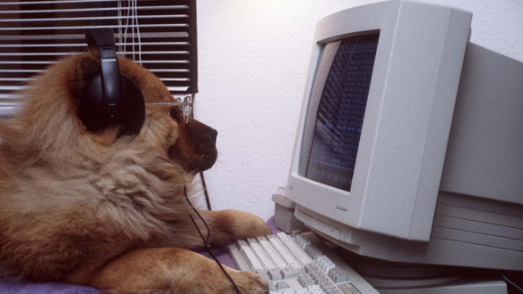

***
# Application Lifecycle Management
***
Vidas Vasiliauskas
---
### What is a project?

---
* Fixed time
* FIxed budget
* Clear start/end
* Defined goals
---
### So what is a product?

---
* Longer lifecycle
* Multiple projects
* Outcome of a project
---
# Who are involved?
---

---
### PM - Project manager

---
### The Implementation Team

---
### The Business

---
### End Users

---
### How we do it - waterfall way
---
* Business problem analysis
* Define goals
* Design and planning
* Implementation
* Quality Assurance
* Deployment
---
### How we do it - agile way
---
* Business problem analysis
* Define deliverables and definition of done
  1. Implement deliverable(s)
  2. Test
  3. Delivery
  4. Retrospective
  5. Goto to [1] and repeat untill all deliverables done
* Final delivery
---
***
### Fail fast = learn fast
***
---
When you are stuck - G.R.O.W.
---

---
# This is it!
@Vasiliauskas
https://github.com/Vasiliauskas/
https://www.linkedin.com/in/vidasvasiliauskas