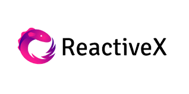

***
##Event Driven Architecture with


Vidas Vasiliauskas
Note: greet, intro self
---
< wikipedia >
####Message-driven architecture is a software architecture pattern for production, detection, consumption and reaction to events
</ wikipedia >
Note: hate wiki talks
---
Over-reactive?
Note: trending or quite old? Functional programming
---
### Techradar 2016

Note: trial is a good traction 
---

Note: language count
---
``` cs
interface IObservable<out T>
{
    Subscribe(IObserver<T>)
}

interface IObserver<in T>
{
	OnNext(T)
	OnError(Exception)
	OnCompleted()
}
```
Note: BCL .NET 4.0, one is important, other one secondary
---
## Rx.net
https://github.com/Reactive-Extensions/Rx.NET
Note: Foundation, open sourced
---
``` cs
using System.Reactive;
```
Note: Guess namespace
---
``` cs
Subject<T>
```
``` cs
RepeatSubject<T>
```
``` cs
BehaviorSubject<T>
```
``` cs
AsyncSubject<T>
```
``` cs
// ISubject<T> : ISubject<T,T>, IObservable<T>, IObserver<T> 
```
Note: 4 dudes, CODING
---

Note: Pull vs push, streaming
---
...to sequence

Note: all the power where make sense, CODING
---
####**Rx** vs **Linq**
###                 136 : 55
(No overloads)
Note: CODING
---
``` cs
Amb(IObservable)
AsyncLast()
Buffer(int i) // overload with timespan for time buffer
CombineLatest(IObservable, combineFunc)
Merge(IObservable)
Switch()
```
Note: favorite, AMB, CODING
---

---
### Testing hard or hardly testing?
``` cs
class TestScheduler // Implements IScheduler
```
Note: CODING
---
* UI events
* Domain events
* Streaming services
* Live queries
* Parallel computing
* Mapping and reducing sequences
* Abstracting message queues like RabbitMQ, MS MQ, etc.
---
* http://www.reactivemanifesto.org/
* http://reactivex.io/
* http://www.introtorx.com/
* https://github.com/Reactive-Extensions/
* https://github.com/Vasiliauskas
---
Ačiū :)


